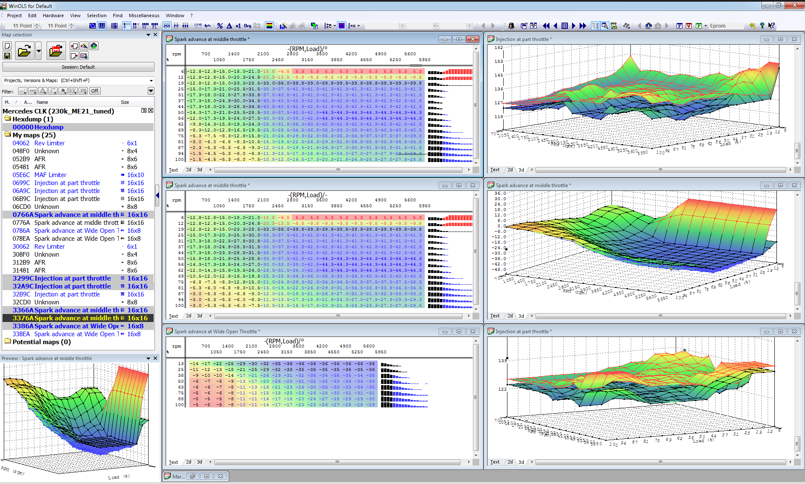
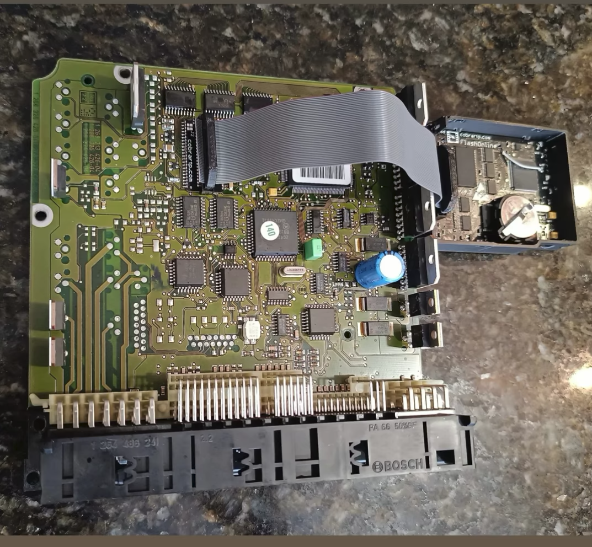
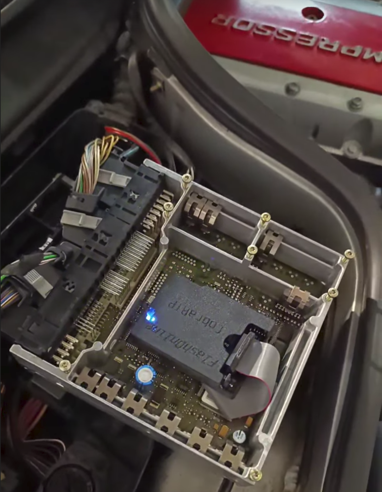

# Mercedes M111 Kompressor ECU Tuning — Bosch ME2.1 Maps, WinOLS & TunerPro

Free ECU tuning resources and reverse-engineering documentation for **Mercedes-Benz M111 230 Kompressor and 200 Kompressor engines with Bosch ME2.1**. This project brings together ECU binary files, WinOLS map packs (`.kp` / `.csv`), a TunerPro XDF, calibration comparisons and Python tools for checksum correction and map visualization.

The aim is to make these ECUs easier to understand and calibrate: fuel and ignition maps, supercharger bypass control, temperature-related ignition correction, and the limiter behavior encountered with larger supercharger pulleys or missing ABS signals.

> [!TIP]
> **Need a custom tune for your engine?** Contact **[Daniel at daniel@drasite.com](mailto:daniel@drasite.com) or via [Instagram @dani_ruiz24](https://www.instagram.com/dani_ruiz24/)**.

[WinOLS map packs](Map%20Definitions/) · [TunerPro XDF](MAPPACK_230kompressor_ME2.1.xdf) · [ECU binaries](Original%20Binaries/) · [Map comparison images](tables/) · [Getting started](#getting-started)



## Vehicle and ECU compatibility

The project focuses on the Bosch ME2.1-equipped M111 Kompressor engines found in vehicles such as:

- Mercedes-Benz **C200 Kompressor / C230 Kompressor (W202).**
- Mercedes-Benz **CLK200 Kompressor / CLK230 Kompressor (W208).**
- Mercedes-Benz **SLK200 Kompressor / SLK230 Kompressor (R170).**

> [!IMPORTANT]
> The supplied tuned binary `230k_ME21.BIN` is a reference calibration, not a universal file to flash. Start with a backup of your own ECU and transfer relevant changes using definitions that match its software.
>
> It is possible to install a different binary version on your ECU without issues, but it might lack some functionalities.

## Downloads and repository contents

| Resource | What it contains |
| --- | --- |
| [WinOLS map packs](Map%20Definitions/) | Software-specific `.kp` and `.csv` definitions for locating and editing calibration tables. |
| [Extended ME2.1 CSV definitions](MAPPACK_230kompressor_ME2.1.csv) | Additional map definitions for binary `230k_ME21.BIN`. |
| [TunerPro XDF](MAPPACK_230kompressor_ME2.1.xdf) | Definitions identified in the XDF header as **114.235404.04**. This is not a universal XDF for every ME2.1 version. |
| [Original ECU binaries](Original%20Binaries/) | A collection of M111 Kompressor software versions for analysis and comparison. |
| [Stock reference binary](230k_ME21_STOCK.BIN) | The project's stock reference file. |
| [Tuned reference binary](230k_ME21.BIN) | The project's modified calibration for studying changes. |
| [Text hex dump](230k_ME21.BIN.XXD) | A text representation of the tuned binary for reviewing changes. |
| [Map comparison images](tables/) | Rendered calibration tables grouped for comparison between binaries. |
| [Checksum tool](me21_checksum.py) | Verify and correct the two calibration checksums implemented by the script. |
| [Table image exporter](ecu_tables.py) | Generate PNG map images from binary files and WinOLS CSV definitions. |

### ECU software versions and available definitions

These are the versions currently represented in the `Original Binaries` directory. A binary being available does not mean every table has been identified or validated.

| Engine label in archive | ECU software | WinOLS definitions |
| --- | --- | --- |
| 230 Kompressor | `114.235034.34` | [CSV](Map%20Definitions/230Kompressor_114.235034.csv) · [KP](Map%20Definitions/230Kompressor_114.235034.kp) |
| 230 Kompressor | `114.235035.52` | [CSV](Map%20Definitions/230Kompressor_114.235035.csv) · [KP](Map%20Definitions/230Kompressor_114.235035.kp) |
| 230 Kompressor | `114.235153.52` | [CSV](Map%20Definitions/230Kompressor_114.235153.csv) · [KP](Map%20Definitions/230Kompressor_114.235153.kp) |
| 200 Kompressor | `114.235355.56` | [CSV](Map%20Definitions/200Kompressor_114.235355.csv) · [KP](Map%20Definitions/200Kompressor_114.235355.kp) |
| 230 Kompressor | `114.235404.04` | [CSV](Map%20Definitions/230Kompressor_114.235404.csv) · [KP](Map%20Definitions/230Kompressor_114.235404.kp) · [XDF](MAPPACK_230kompressor_ME2.1.xdf) |
| 230 Kompressor | `114.235516.16` | [CSV](Map%20Definitions/230Kompressor_114.235516.csv) · [KP](Map%20Definitions/230Kompressor_114.235516.kp) |
| 230 Kompressor | `114.235819.20` | [CSV](Map%20Definitions/230Kompressor_114.235819.csv) · [KP](Map%20Definitions/230Kompressor_114.235819.kp) |
| 230 Kompressor | `114.236338.39` | [CSV](Map%20Definitions/230Kompressor_114.236338-114.236438.csv) · [KP](Map%20Definitions/230Kompressor_114.236338-114.236438.kp) |
| 230 Kompressor | `114.236438.40` | [CSV](Map%20Definitions/230Kompressor_114.236338-114.236438.csv) · [KP](Map%20Definitions/230Kompressor_114.236338-114.236438.kp) |
| 230 Kompressor | `114.236643.43` | [CSV](Map%20Definitions/230Kompressor_114.236643.csv) · [KP](Map%20Definitions/230Kompressor_114.236643.kp) |

## Getting started

1. Read and save your original ECU binary, together with its hardware and software numbers.
2. Find the matching software version in the table above and download its definitions.
3. In **WinOLS**, open the binary and import the matching map pack. In **TunerPro**, open the matching binary and select the appropriate XDF; the supplied XDF targets `114.235404.04`.
4. Check table addresses, dimensions, axes and units before editing. Use the [comparison images](tables/) to explore differences between versions.
5. Save changes to a separate file, verify the applicable checksums and keep a record of each calibration revision.

For the reading and flashing process, see the community [Bosch ME2.0 / ME2.1 read-and-flash guide](https://www.benzworld.org/threads/kompressor-bosch-me2-0-me2-1-ecu-boost-limiter-and-how-to-remove-it-without-maf-clamp-including-read-and-flash-guide.3069431).

## Fuel, ignition and limiter maps

The map packs cover the following areas. Coverage and naming vary by software version, and some names describe an observed effect rather than a fully established function.

| Map family | Relevance to calibration and diagnosis |
| --- | --- |
| **Fuel / injection** | Fuel correction tables for investigating mixture behavior across engine speed and load, including wide-open throttle (WOT). The table represents the percentage of fuel correction to the value calculated by the ECU based on the MAF sensor reading. |
| **Spark advance** | Ignition calibration tables, including maps labeled for WOT. |
| **Supercharger bypass valve position** | Bypass valve calibration relevant to how much compressed air reaches the engine. |
| **Rev limiter** | Engine-speed limit settings. |
| **Launch rev limiter** | Engine-speed limit when stationary. |
| **Warm-up Bypass command minimum** | Minimum boost bypass valve position during warm-up. |
| **Fallback RPM Limiter** | Tables associated in project testing with the approximate 5,700 rpm limit when the ABS signal is unavailable. |
| **Temperature ignition correction** | Tables associated with coolant and intake air temperature (IAT), with load-dependent weighting. |

### Larger pulleys and supercharger cutout

One focus of this project is the loss of boost sometimes observed near high engine speeds after installing a larger crankshaft pulley. The reported behavior is that the ECU disengages the supercharger clutch and opens the bypass valve.

The binaries and map comparisons help investigate why different software versions behave differently with the same hardware changes.

Not all binaries behave equally, and some of them don't limit at all when you increase the supercharger boost. Here's a list of binaries with tested behavior:

❌ **Limit:**
- 9903-230Kompressor_261206457_114.236338.39.BIN
- 9906-230Kompressor_261206458_114.236438.40.BIN
- 9914-230Kompressor_261206570_114.236643.43.BIN

✅ **Don't limit:**
- 9640-230Kompressor_261204573_114.235034.34.BIN
- 9646-230Kompressor_261204527_114.235153.52.BIN
- 9720-230Kompressor_261204747_114.235404.04.BIN

### The 5,700 rpm limit without ABS

Project testing has linked the reduced rev limit with an unavailable ABS signal to the tables labeled **“Fallback RPM Limiter”**. Editing these tables has restored the normal rev limit on the tested setup. This is an observed result for that configuration, rather than proof that the same edit applies to every ECU version.

### Temperature-related ignition retard

The definitions include ignition correction associated with coolant and intake air temperature. The thermal table and its load weighting need to be considered together: a value displayed in the table is not necessarily the final correction applied to the ignition angle, but the value applied at full throttle. The binary includes an extra table for the percentage applied to the ignition retard value based on the amount of throttle pedal input.

## 230 Kompressor tuning

### STAGE 1 (~210-220hp)
- 218mm crankshaft pulley
- Cold air intake
- Exhaust
- CAT delete (optional)
- ECU tune

### STAGE 2 (~230-240hp)
- [Ported supercharger](https://www.benzworld.org/threads/home-port-job-of-the-eaton-m62-s-c.1516156/)
- Intercooler
- Remove the MAF and throttle body screens
- Wideband oxygen sensor
- 320cc Bosch Red injectors 0280155759
- 1-6 Bar adjustable fuel pressure regulator (adjust pressure to reach 11.8-12 AFR at 5,200rpm WOT = ~3.8-4Bar FPR)
- BOSCH FR6DC spark plugs
- ECU tune

### Eaton M62 supercharger speed and pulley ratios

According to Eaton's documentation, the M62 supercharger is capable of sustaining a maximum speed of 14,000 rpm, but many users have increased it to 15,000 or even 16,000 rpm for short periods of time without trouble.

| Pulley combination | Crank pulley | Supercharger pulley | At 5,800 engine rpm | At 6,200 engine rpm |
| --- | --- | --- | ---: | ---: |
| Stock example | 185 mm | 94 mm | 11,415 rpm | 12,202 rpm |
| Larger crank pulley | 218 mm | 94 mm | 13,451 rpm | 14,379 rpm |
| Smaller supercharger pulley | 185 mm | 87 mm | 12,333 rpm | 13,184 rpm |
| Both pulley changes | 218 mm | 87 mm | 14,533 rpm | 15,536 rpm |

### Shorter differential

Shorter 3.92 differential, for example from a CLK200 non-Kompressor (original is 3.46).

- CLK200 W208 A2023502314
- SLK200 R170 A1243504598 / A1703501114
- C W202
  - A2023502314
  - A1243504598
  - A2023501814
  - A1703501114
  - A2023504603
  - A1243507514
  - A1243502874
  - A1243509614
- E W210
  - A2023502314
  - A1703501114
  - A2023501814

## Real-time tuning with CobraRTP FlashOnline

By installing the **CobraRTP FlashOnline board, you can add real-time tuning capabilities** to the stock ECU (both the ME2.0 and ME2.1).





After modifications, the checksum should normally be corrected, but I just found out that the car doesn't care about it. If you tune your ECU live and forget to update the checksum, the next time you start the engine it will work anyway. So the checksum doesn't seem to be relevant for this ECU (it didn't even show a CEL code via OBD).

## Further reading

- [Bosch ME2.0 / ME2.1 boost-limiter discussion and ECU reading/flashing guide](https://www.benzworld.org/threads/kompressor-bosch-me2-0-me2-1-ecu-boost-limiter-and-how-to-remove-it-without-maf-clamp-including-read-and-flash-guide.3069431).
- [Eaton M62 supercharger porting discussion](https://www.benzworld.org/threads/home-port-job-of-the-eaton-m62-s-c.1516156/).

## Python tools

### Verify and correct calibration checksums

The [checksum script](me21_checksum.py) uses Python's standard library and expects a **256 KiB binary** with the checksum layout implemented in the script.

Verify a file without modifying it:

```bash
python3 me21_checksum.py your_read.BIN
```

Write a corrected copy:

```bash
python3 me21_checksum.py your_modified.BIN -o your_corrected.BIN
```

The tool handles the two calibration regions defined in its source; it is not a generic checker for every Bosch ECU. Its exit status describes whether the input checksums matched, so re-run verification on the corrected output when using it in automation.

### Generate map comparison images

The [image exporter](ecu_tables.py) requires Python, NumPy and Matplotlib. With those dependencies installed, run it from the repository root:

```bash
python3 ecu_tables.py "Original Binaries" "Map Definitions" -o tables
```

The script matches binaries and CSV files using software identifiers in their filenames. It exports converted table values as PNG images and leaves the binaries unchanged. Output folders use each table's position in memory-address order and its name. Unmatched versions are reported; use `--assign BINARY=CSV` only after establishing that the selected definitions match the binary.
